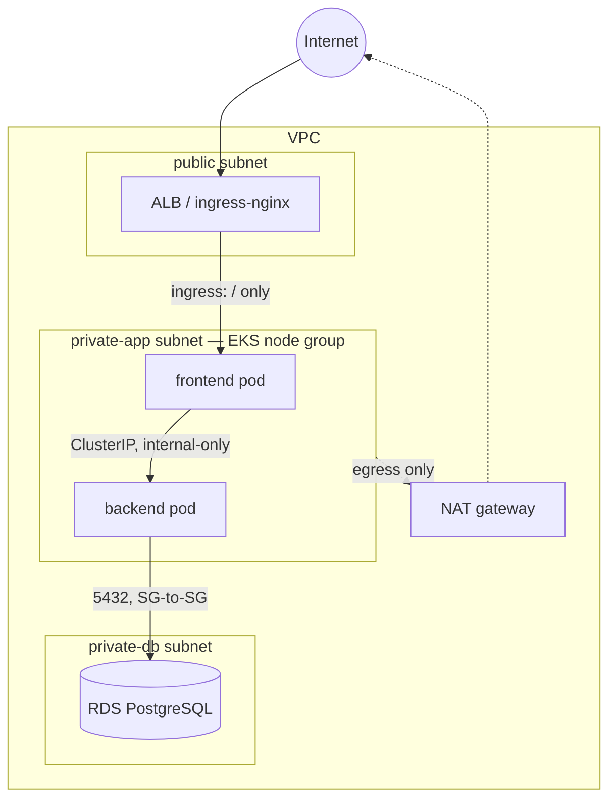

# Plinth

*The base layer your workloads stand on.*

[](https://github.com/iAhmedMusa/devops-assessment/actions/workflows/deploy.yml)
[](LICENSE)
[](terraform/)
[](k8s/)
[](docs/decisions/0006-multi-arch-images-and-trivy-gate.md)
[](https://github.com/iAhmedMusa/devops-assessment/releases/latest)

Plinth is a production-shaped platform foundation on AWS: Terraform-provisioned VPC, EKS and RDS; Kustomize-managed workloads across four environments; and a release pipeline with OIDC federation, multi-arch builds, vulnerability gating, and a manual production approval gate. A small Next.js + FastAPI application rides on top as the workload under management — it exists to give the platform something real to carry.

*A plinth is the base a structure stands on — invisible when the building works, and the reason it stands at all.*



## What this demonstrates

| Capability | Implementation | Where |
|---|---|---|
| Container build | Multi-stage Dockerfiles, multi-arch (amd64/arm64) images built in CI | [`backend/Dockerfile`](backend/Dockerfile), [`frontend/Dockerfile`](frontend/Dockerfile) |
| Orchestration | Kustomize base + 4 overlays, PDBs, readiness/liveness probes, non-root/read-only-rootfs hardening | [`k8s/base/`](k8s/base/), [`k8s/overlays/`](k8s/overlays/) |
| Infrastructure as code | 5 custom Terraform modules, 3 environments, S3-native state locking | [`terraform/`](terraform/) |
| Secrets management | RDS-managed master password in Secrets Manager, never in Terraform; OIDC federation for CI | [`terraform/modules/rds/main.tf`](terraform/modules/rds/main.tf), [ADR-0004](docs/decisions/0004-secrets-manager-over-terraform-managed-secrets.md) |
| Network isolation | Three-tier VPC + SG-to-SG rules + default-deny NetworkPolicy — two independent enforcement layers | [`terraform/modules/network/main.tf`](terraform/modules/network/main.tf), [`k8s/base/network-policies.yaml`](k8s/base/network-policies.yaml) |
| Supply-chain security | Trivy vulnerability scan on every image; immutable semver+SHA tags, `latest` never used | [`.github/workflows/deploy.yml`](.github/workflows/deploy.yml), [ADR-0006](docs/decisions/0006-multi-arch-images-and-trivy-gate.md) |
| Observability | CloudWatch log groups (control-plane + app), Container Insights, CPU/storage alarms | [`terraform/modules/monitoring/main.tf`](terraform/modules/monitoring/main.tf) |
| Release strategy | Trunk-based, tag-triggered pipeline; immutable-artifact promotion; manual production approval gate | [`docs/ci-cd.md`](docs/ci-cd.md), [`.github/workflows/deploy.yml`](.github/workflows/deploy.yml) |

## Quick start

```bash
cp .env.example .env
docker compose up -d --build

curl http://localhost:8080          # "Application is running"
curl http://localhost:8080/health   # {"status":"ok"}
```

Open http://localhost:3000 to create, edit, and delete profiles.

### Environment variables

| Service  | Variable          | Example                                              | Notes                              |
|----------|-------------------|-------------------------------------------------------|-------------------------------------|
| db       | POSTGRES_USER     | appuser                                                | from `.env`                         |
| db       | POSTGRES_PASSWORD | change-me                                              | from `.env`                         |
| db       | POSTGRES_DB       | appdb                                                  | from `.env`                         |
| backend  | DATABASE_URL      | postgresql+asyncpg://appuser:change-me@db:5432/appdb   | composed by compose from `.env`     |
| backend  | FRONTEND_ORIGINS  | http://localhost:3000                                  | comma-separated CORS origins        |
| frontend | BACKEND_URL       | http://backend:8080                                    | build-arg — baked into the image    |

### Backend tests

```bash
cd backend
python3.12 -m venv .venv && source .venv/bin/activate
pip install -r requirements-dev.txt
pytest -v
```

No database needed — tests use an in-memory SQLite override.

## Design decisions

Every non-obvious choice below has a real alternative — the ADR says why
this one won, not just what was built.

| ADR | Decision |
|---|---|
| [0001](docs/decisions/0001-kustomize-over-helm.md) | Kustomize over Helm for environment overlays |
| [0002](docs/decisions/0002-oidc-federation-over-long-lived-credentials.md) | OIDC federation over long-lived cloud credentials in CI |
| [0003](docs/decisions/0003-security-group-to-security-group-over-cidr.md) | Security-group-to-security-group rules over CIDR blocks |
| [0004](docs/decisions/0004-secrets-manager-over-terraform-managed-secrets.md) | Secrets Manager over Terraform-managed secrets |
| [0005](docs/decisions/0005-default-deny-networkpolicy-posture.md) | Default-deny NetworkPolicy posture |
| [0006](docs/decisions/0006-multi-arch-images-and-trivy-gate.md) | Multi-arch images + Trivy gate in the release path |
| [0007](docs/decisions/0007-ephemeral-kind-cluster-over-persistent-staging.md) | Ephemeral kind cluster for staging verification over a persistent staging environment |
| [0008](docs/decisions/0008-custom-terraform-modules-over-registry-modules.md) | Custom Terraform modules over community registry modules |
| [0009](docs/decisions/0009-s3-native-locking-over-dynamodb.md) | S3-native locking over DynamoDB for state locking |
| [0010](docs/decisions/0010-mocked-ecr-and-production-push.md) | Mocked ECR push and production deploy over a real cloud account |

## Repository map

```
plinth/
├── backend/              FastAPI service — async CRUD API, SQLAlchemy 2.x, pytest suite (SQLite override, no DB needed)
├── frontend/              Next.js 16 UI — profile CRUD, proxies /api/* to the backend at build time
├── k8s/
│   ├── base/                Kustomize base — Deployments, Services, Ingress, NetworkPolicy, PDBs
│   └── overlays/             Per-environment patches: local, staging, production, ci
├── terraform/
│   ├── modules/               5 custom modules: network, eks, ecr, rds, monitoring
│   └── envs/                   Per-environment tfvars: dev, staging, production
├── docs/
│   ├── architecture.md         System overview, tiers, tradeoffs
│   ├── networking.md           Request path + what blocks unauthorized traffic at each hop
│   ├── ci-cd.md                 Pipeline design, trigger model, secrets, branching strategy
│   ├── roadmap.md               Now/Next/Later hardening backlog, honest about what's not built
│   ├── decisions/                10 ADRs — why this over the alternative, for every non-obvious choice
│   ├── operations/                Runbook, disaster recovery, upgrade paths
│   └── proof.md                   Screenshots + terraform plan output from real runs
├── .github/workflows/       CI/CD pipeline definition
└── docker-compose.yml      One-command local stack
```

## Evidence

Reviewers rarely run the code, so here's what a real run looks like.

<table>
<tr>
<td width="33%">

**Local cluster running**
Two backend replicas, two frontend replicas, one postgres — all `Running` in `plinth-local`.


</td>
<td width="33%">

**Full pipeline, all green**
Test → build/push → mock ECR → release → staging deploy → mock production, 14m19s end to end.


</td>
<td width="33%">

**Production approval gate**
Pipeline paused — GitHub environment protection requesting a review before the production job runs.


</td>
</tr>
</table>

Terraform: a real `plan` against `envs/dev.tfvars` — 59 resources to create, 0 to change, 0 to destroy, run with placeholder credentials and no live AWS account reachable (full output: [`docs/proof/tfplan-dev.txt`](docs/proof/tfplan-dev.txt)).

More screenshots, build/scan artifacts, and the full breakdown: [`docs/proof.md`](docs/proof.md). Real CI run: [actions/runs/28698340896](https://github.com/iAhmedMusa/devops-assessment/actions/runs/28698340896) (v0.3.0). Latest release: [v0.3.0](https://github.com/iAhmedMusa/devops-assessment/releases/tag/v0.3.0).

## Documentation

| Topic | Doc |
|-------|-----|
| Architecture | [docs/architecture.md](docs/architecture.md) |
| CI/CD pipeline | [docs/ci-cd.md](docs/ci-cd.md) |
| Kubernetes manifests | [k8s/README.md](k8s/README.md) |
| Terraform infrastructure | [terraform/README.md](terraform/README.md) |
| Networking | [docs/networking.md](docs/networking.md) |
| Runbook | [docs/operations/runbook.md](docs/operations/runbook.md) |
| Disaster recovery | [docs/operations/disaster-recovery.md](docs/operations/disaster-recovery.md) |
| Upgrades | [docs/operations/upgrades.md](docs/operations/upgrades.md) |
| Architecture decisions | [docs/decisions/](docs/decisions/) |
| Roadmap | [docs/roadmap.md](docs/roadmap.md) |
| Proof of work | [docs/proof.md](docs/proof.md) |

## About the author

Ahmed Musa
