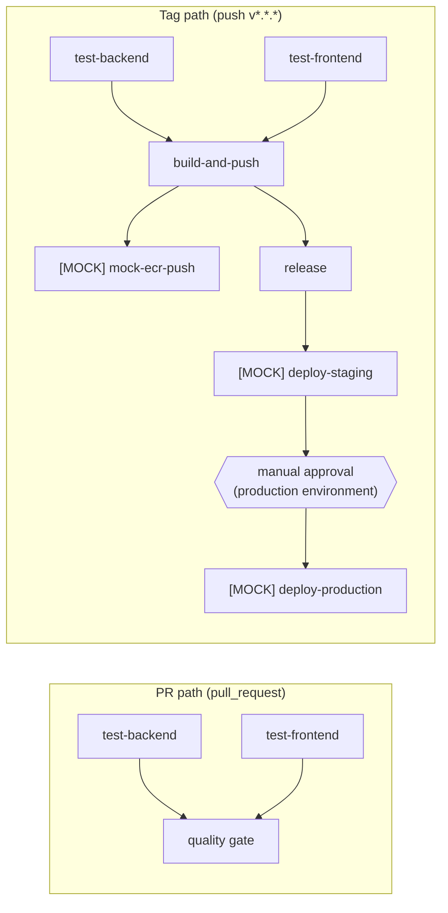

# CI/CD pipeline

Workflow file: [`.github/workflows/deploy.yml`](../.github/workflows/deploy.yml)

## 1. Pipeline overview



Opening a pull request runs the two test jobs only — nothing is built,
pushed, or released. Pushing a `v*.*.*` tag runs the full chain: tests gate
the build, the build gates both the mock ECR push and the GitHub release,
the release gates a staging deploy, and staging gates a production deploy
that pauses for manual approval.

## 2. Trigger model

| Event                        | What runs                                    |
|-------------------------------|-----------------------------------------------|
| `pull_request`                | `test-backend`, `test-frontend`               |
| `push` of tag `v*.*.*`        | full pipeline (test → build/push → release/mock-ecr → mock deploy) |

To cut a release:

```
git tag v1.0.0
git push origin v1.0.0
```

Ordinary commits and PRs never trigger a build or a release — only an
explicit version tag does. This keeps `main` cheap to push to while making
every published image traceable to one tag.

## 3. Image tagging policy

Every image is tagged twice:

- **semver**, from the tag itself (`v1.0.0` → `1.0.0`)
- **immutable short SHA** (`git rev-parse --short HEAD`)

`latest` is never used. A floating tag can silently change under a
deployment that references it, which defeats reproducibility and makes
rollbacks ambiguous — pin to a semver or a SHA and both point at exactly one
image, forever.

## 4. Registry strategy

Docker Hub is used as the real registry: images are actually built and
pushed there on every tag, using a free-tier account, so the pipeline is
provable end-to-end rather than described. The assessment's own wording
("push images to ACR or ECR, or mock the push") is satisfied by an ECR push
step that is clearly labeled `[MOCK]` and only echoes the exact command
sequence a real push would run — it never calls the AWS API.

The mock step's comments describe the intended production path: no AWS
access keys in the repo at all, only GitHub OIDC federation
(`aws-actions/configure-aws-credentials` with `role-to-assume`), which
exchanges a short-lived token for the run rather than storing a long-lived
credential.

## 5. Secrets management

**What lives in GitHub Secrets today:**

- `DOCKERHUB_USERNAME`, `DOCKERHUB_TOKEN` — a scoped Docker Hub access
  token, not the account password. It can be revoked and rotated
  independently of the account credential, and it only grants push access
  to this repo's images.

**How production would differ:**

- Cloud authentication (AWS/Azure) would use OIDC federation instead of
  long-lived keys — the workflow requests a short-lived token from the
  cloud provider's STS at run time, and nothing cloud-related is stored as
  a GitHub secret.
- Application runtime secrets (database credentials, API keys the running
  service needs) belong in a managed secret store — AWS Secrets Manager or
  Azure Key Vault — injected at deploy time, not baked into images or
  checked into the workflow.
- Production deploys would run under a GitHub environment with required
  reviewers, so a human approves the gate between "image built" and
  "image running in production."

**What must never be in the repo:** `.env` files, kubeconfig, cloud access
keys, or Terraform state. All of these are excluded via `.gitignore` and
must stay that way even as the pipeline grows.

## 6. Branching and promotion strategy

**Model:** trunk-based development. `main` is the single long-lived branch;
all work happens on short-lived feature branches merged in via PR. `main`
is protected — a PR with green checks is required, and force-pushes are not
allowed.

**Promotion is by artifact, not by branch.** A `v*.*.*` tag builds one
immutable pair of images (semver + SHA, see above). Those exact images are
promoted from staging to production — `deploy-staging` and
`deploy-production` deploy the same tags; nothing is rebuilt between
environments. If it passed in staging, what reaches production is the
identical binary, not a recompiled approximation of it.

**Production gating:** the `deploy-production` job declares
`environment: production`, and that GitHub environment has a
required-reviewer rule configured in repo settings. The pause for manual
approval before production is not expressed anywhere in the workflow YAML
— it's enforced entirely by that environment protection rule.

**Why not environment branches** (separate `dev`/`staging`/`prod` branches,
GitFlow-style): merging as the promotion mechanism lets branches drift out
of sync with each other, duplicates the work of applying hotfixes to every
downstream branch, and makes "what's actually running in production" a
question you answer by diffing branches instead of just reading a tag.
Worse, rebuilding per branch breaks artifact immutability — a "prod build"
and a "staging build" of the same commit are no longer guaranteed to be the
same bytes. Trunk-based development with immutable artifacts and
environment-level gates avoids all of that, and lines up with where the
industry has been heading (DORA, GitOps).

**Infrastructure-level environment separation** (dedicated dev/staging/prod
clusters, isolated state) is a different concern from this promotion flow
and is handled — and documented — in the Terraform phase.
